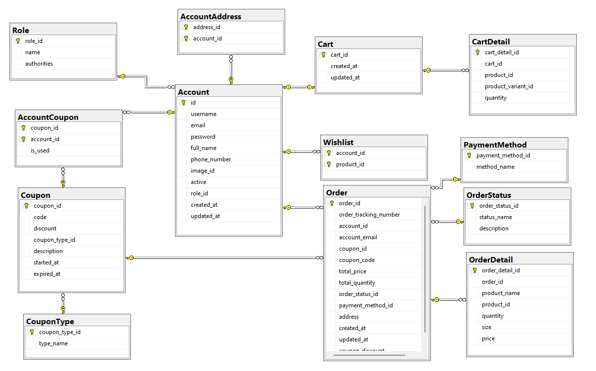
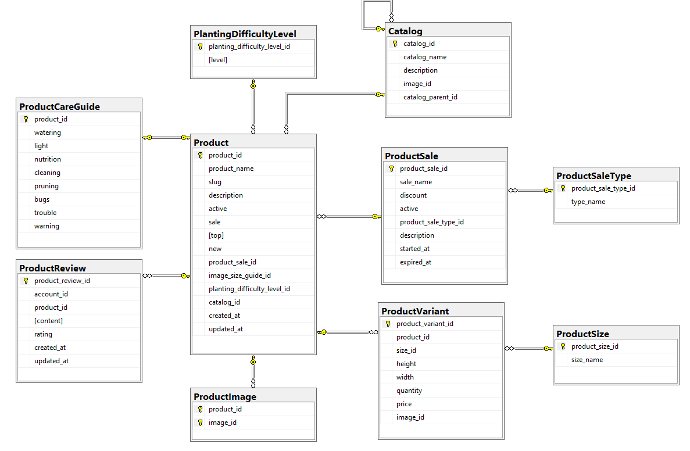
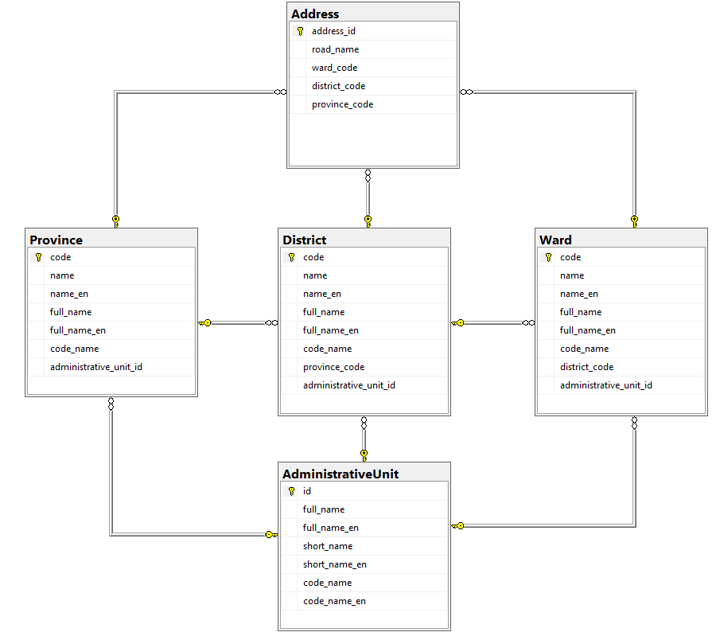
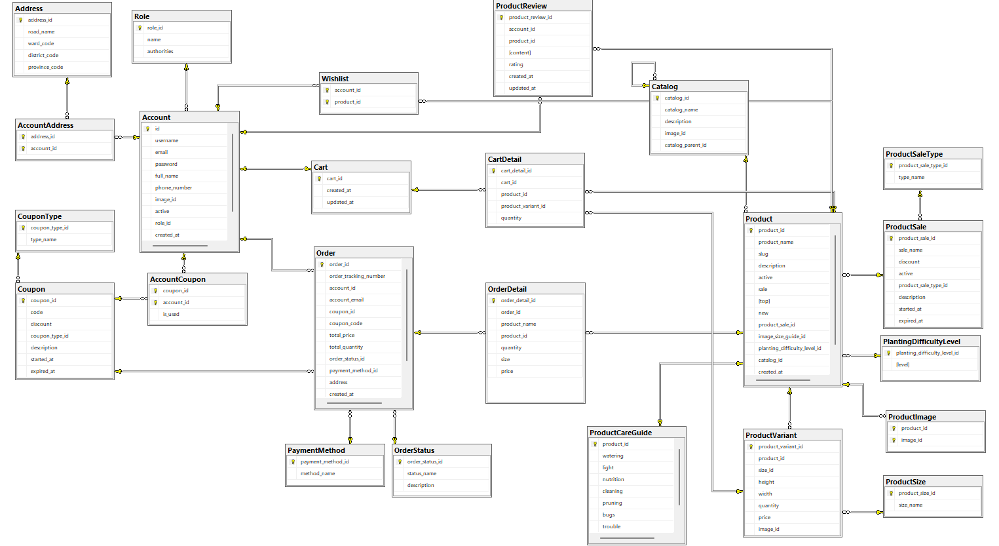

### TECHWIZ COMPETITION (8/2023)
#### PlantNest Web Application

#### Short Description

An online plant nursery Web application is a solution for this and allows people
to shop for plants from the comfort and convenience of their homes. Some plants
can survive even with minimal care, while others demand much more attention.
The online plant nursery Web application can also provide information to users
on proper care for plants. Through such an application, users can view available
plants with details such as the plant's cost, level of maintenance required,
watering schedule, and so on. Users can also purchase plants and related
gardening supplies or tools through the Web application. 

#### Technologies used:
- Backend: Java, Spring Boot, Spring Data JPA, Spring Data REST, Spring Security
- Frontend: HTML, CSS, Typescript, Angular
- Database: MySQL

#### Database Design
- Account 
    

- Product
    

- Address
    

- All
    

